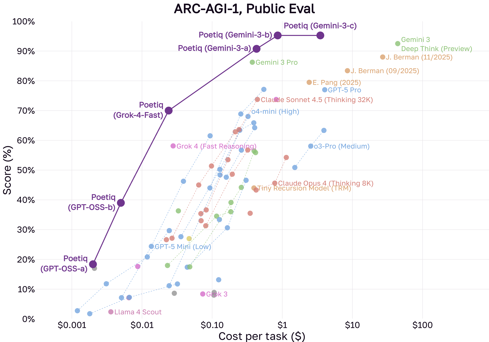
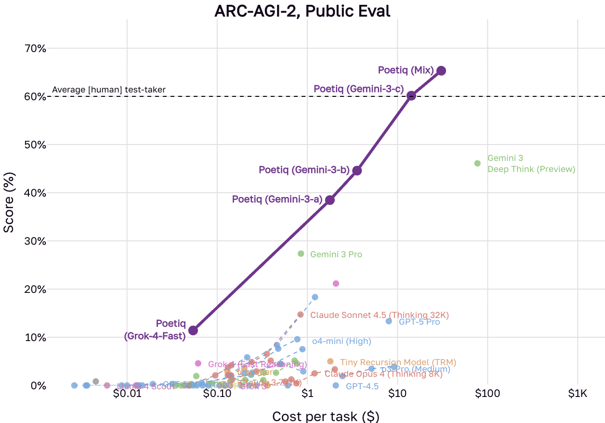

# clarc — Contract-Learning for ARC-AGI

[](https://opensource.org/licenses/MIT)
[](https://www.python.org/downloads/)
[](https://arcprize.org/)

**Can a sound, verifiable layer make an LLM solve ARC better — and where does that
actually pay off?** `clarc` is a research solver that wraps the dead-simple
[poetiq](https://poetiq.ai) refinement loop (*generate `transform()` → run on the train
pairs → feed back the diff*) in a **machine-checkable description layer**: a typed DSL,
z3 contracts over an abstract grid domain, and object-correspondence duals. The
governing idea (from the original [research sketch](knowledge/)) is an *"ARC detective"*:
every step is **positively justified** and **soundly verified** — a lesson is admitted
only after Python/z3 re-confirms it on every training pair, so no hallucinated knowledge
ever accumulates.

The result is a clean mix of **sound positives** and **rigorous negatives** — and a
sharp picture of exactly where neurosymbolic structure helps an LLM coder and where ARC's
few-shot underdetermination defeats it.

> Built on top of poetiq's record-setting ARC-AGI harness (the baseline / "A0" arm).
> See [Baseline & attribution](#baseline--attribution).

---

## The interesting part

- **A typed DSL ⇄ SMT dual that is sound by construction.** Each primitive carries a
  numpy `apply` *and* a z3 relational contract over an abstract grid state σ
  (dims, histogram, object summary, symmetry bits). Candidate pipelines are **refuted
  before they ever execute** via z3 unsat cores — measured **99.4% refutation power with
  0 false refutations in 13,641 checks**.
- **An LLM-free symbolic solver that grows its own DSL.** `synth_models` enumerates
  spec-feasible skeletons from the clause-pruned subspace and `param_search` pins their
  parameters — solving real ARC tasks with **no LLM call at all**, and even composing
  *induced* primitives.
- **A faithful CEGIS loop** (typed candidates · traceable counterexamples · a monotone
  clause lattice · synthesis from the pruned space) layered on a contract-learning CDCL
  loop whose verified invariants demonstrably **speed convergence at zero harm**.

## Research findings

Full write-up in **[FINDINGS.md](FINDINGS.md)**; lab notebooks in
[`docs/notebook/`](docs/notebook/). Headlines:

- ✅ **Growing the DSL lifts sound coverage.** `symmetry_repair` (+8 ARC-1 tasks) and
  `connect_dots` (+1) are solved **LLM-free and test-generalizing**, recovering even a
  hard instance (`929ab4e9`) the free-form LLM baseline misses.
- ✅ **The param-search lever** turned pure-symbolic coverage from **0/40 → 2/40** (both
  generalizing) — a z3 param-witness limitation, not a DSL limitation, fixed cheaply.
- ✅ **Verified contracts speed convergence at zero harm:** median iterations-to-solve
  **8 → 5 → 4 → 3** across `A0 → A5 → A1 → A1L`, with human-readable induced invariants
  and `harm = 0`. (Raw solve-rate lift is directional only — the floor dominates.)
- ❌ **The counterexample channel does *not* guide a code-gen solver — a rigorous
  negative.** The contracts specific enough to be *actionable* aren't justified by 3–4
  examples; the ones that *are* justified aren't actionable. This is ARC's
  underdetermination reappearing inside the verifier.
- ❌ **The structural stratum is the genuine ARC wall**, confirmed dead from three
  independent angles (single-prim mining saturated · 2-prim composition 0/18 · per-object
  induction can't restructure). Sound gating stops overfit; it can't conjure the rule.

## Frontiers

The live edges where this becomes interesting again — each attacked through the
**$0-probe-first R&D loop** ([CLAUDE.md](CLAUDE.md#the-rd-loop--how-to-test-a-new-hypothesis)):

1. **The agent-extends-DSL loop** *(the core unfinished goal)* — let the LLM compose the
   enriched DSL **and induce task-relevant primitives until the train pairs are
   expressed**, instead of routing around coverage gaps. The synth path already does this
   for single prims; the open problem is multi-step composition under the soundness gate.
2. **Generalizable relational / program induction** for the structural stratum — the
   hard, research-scale problem behind the negative result above.
3. **A per-object SELECTION sublanguage** to unlock object-level composition (move /
   per-object recolor) the current global prims can't express.
4. **Multi-seed evaluation** to lift the ~2-task noise floor that makes single-seed
   solve-rate deltas unreadable.

To probe a new hypothesis cheaply: `uv run python -m clarc.synth_coverage --depth 2`
measures the DSL ceiling with no LLM and no spend.

## How to run

```bash
uv sync
uv run pytest -q                          # offline tests (CLI tests skipped by default)

# $0, no LLM — reproduce the symbolic coverage floor (≈2/40, both generalizing):
uv run python -m clarc.synth_coverage --depth 2

# $0 — DSL refutation power + soundness (reports 0 false refutations):
uv run python -m clarc.probe_dsl

# Offline smoke of the full solve loop (StubGenerator, no API spend):
uv run python -m clarc.ablate --stub --num 2 --arms A0,A1 --seeds 0
```

**A paid head-to-head** (spends; gate it): the runner is resumable and reports cost live.

```bash
uv run python -m clarc.experiment --model claude-sonnet-4-5 --max-thinking 4000 \
    --devset --arms A0,A5,A1,A1L --iters 6
uv run python -m clarc.experiment --report-only --out output/experiment
```

Arms, entry points, and the R&D loop are documented in **[CLAUDE.md](CLAUDE.md)**.

## Repo map

| Path | What |
|---|---|
| `clarc/loop.py`, `solver.py`, `harness.py` | the CDCL solve loop (A/D/E arms), the guided code-gen loop (G arms), the shared runner core |
| `clarc/dsl.py`, `smt.py`, `absdomain.py` | the typed DSL, the z3 CHECK/SYNTH layer, the abstract grid domain σ |
| `clarc/objects.py`, `objsmt.py`, `dual/` | the object-correspondence dual (settled-negative; portfolio floor) |
| `clarc/contracts.py`, `spec.py`, `store.py`, `learn.py`, `library.py` | the contract vocabulary, verified spec, clause store, induction, cross-task library |
| `clarc/run.py`, `experiment.py`, `ablate.py`, `devset.py` | runners + dev set |
| `arc_agi/` | the upstream poetiq harness (baseline, reused by import) |
| `docs/notebook/`, `docs/assets/`, `knowledge/` | lab notebooks · figures · the original research sketch |

## What's wireable into the deployed solver

The deployed poetiq solver (`main.py`) is pure LLM code-gen. Three sound additions from
this research could augment it (all ≥ A0 by construction or $0):

1. **Verified portfolio + verified-selection (`solver.py`, arm G5)** — run the baseline
   plus the verified channel and submit the *union* of train-verified solves (≥ A0 by
   construction); among multiple train-passers, prefer the one whose **test** output
   respects the LOO-trusted invariants — an overfit filter the two-attempt baseline can't
   run.
2. **The LLM-free symbolic fast path** (`symmetry_repair` / `connect_dots` via
   `synth_models` + `param_search`) — a $0, sound, generalizing portfolio member for
   clean-algorithm tasks; it recovered a hard instance the baseline missed.
3. **Verified spec-injection (arm A5)** — sound invariants in the prompt sped convergence
   at zero harm, a potential cost/iteration reduction.

(Not recommended: the SMT/invariant counterexample-guidance channel — a settled negative.)

---

## Baseline & attribution

This repository builds on **Poetiq's** record-setting submission to the ARC-AGI-1 and
ARC-AGI-2 benchmarks — the `arc_agi/` harness and the `A0` baseline arm are theirs,
reused by import and treated as a stable dependency. Their analysis:
[Traversing the Frontier of Superintelligence](https://poetiq.ai/posts/arcagi_announcement/)
and [Poetiq Shatters ARC-AGI-2 State of the Art at Half the Cost](https://poetiq.ai/posts/arcagi_verified/).

<p align="center">
  
  
</p>

To reproduce the poetiq baseline directly: create a `.env` with the relevant API keys
(`GEMINI_API_KEY`, `OPENAI_API_KEY`, …), adjust the constants in `main.py`, and run
`python main.py`. See `arc_agi/config.py` for the expert configurations.

If you use poetiq's results, please cite their post:
Poetiq Team. (2025). *Traversing the Frontier of Superintelligence*. Poetiq AI.
